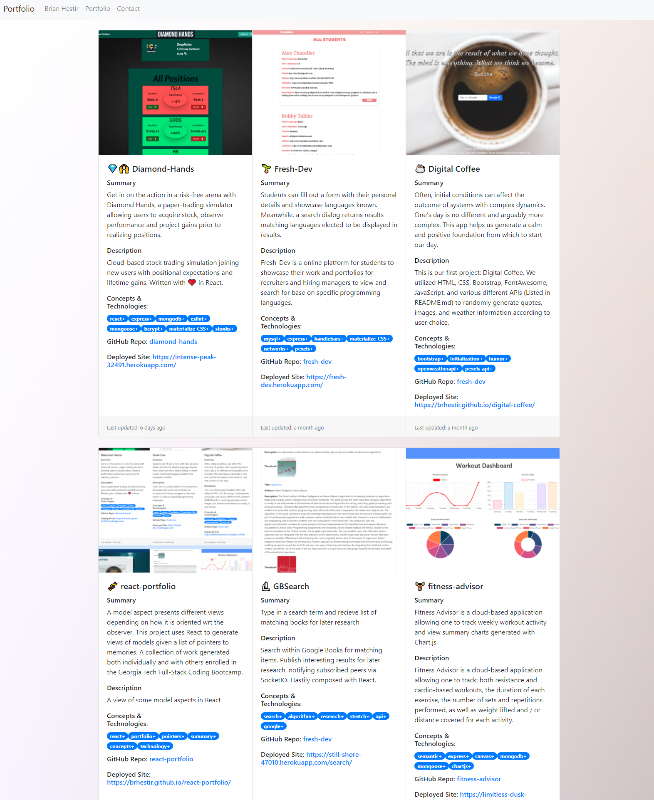

# 

A view of model aspects in React.


## Table of Contents

- [react-portfolio](#react-portfolio)
- [Description](#description)
- [Installation](#installation)
- [Usage](#usage)
- [Licence](#licence)
- [Contributing](#contributing)
- [Questions](#questions)

## Description



A three-tiered collection of work generated both individually and with others enrolled in the Georgia Tech Full-Stack Coding Bootcamp.

[Deployed GitHub-Pages Site](https://brhestir.github.io/react-portfolio/#/portfolio)

[GitHub Repo](https://www.github.com/brhestir/react-portfolio)

## Installation

```bash
npm install
```

## Usage

```bash
npm start
```

## Licence


## Contributing

Clone this repo and create a pull request.

## Questions

Questions/comments/suggestions welcome.
